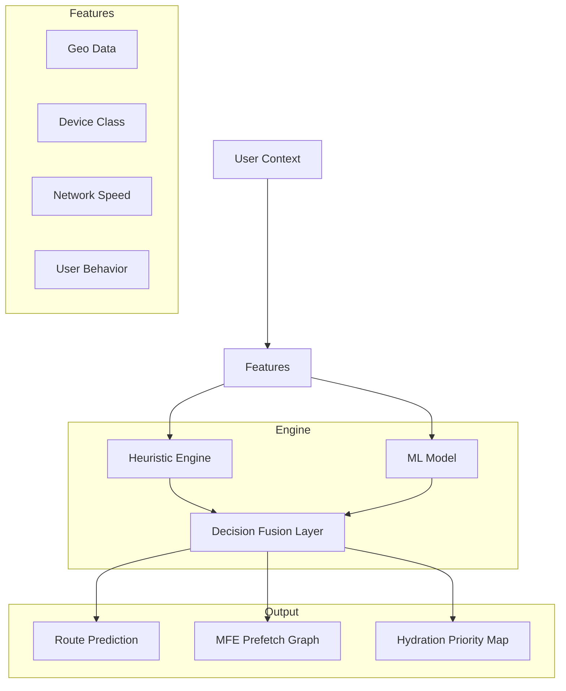
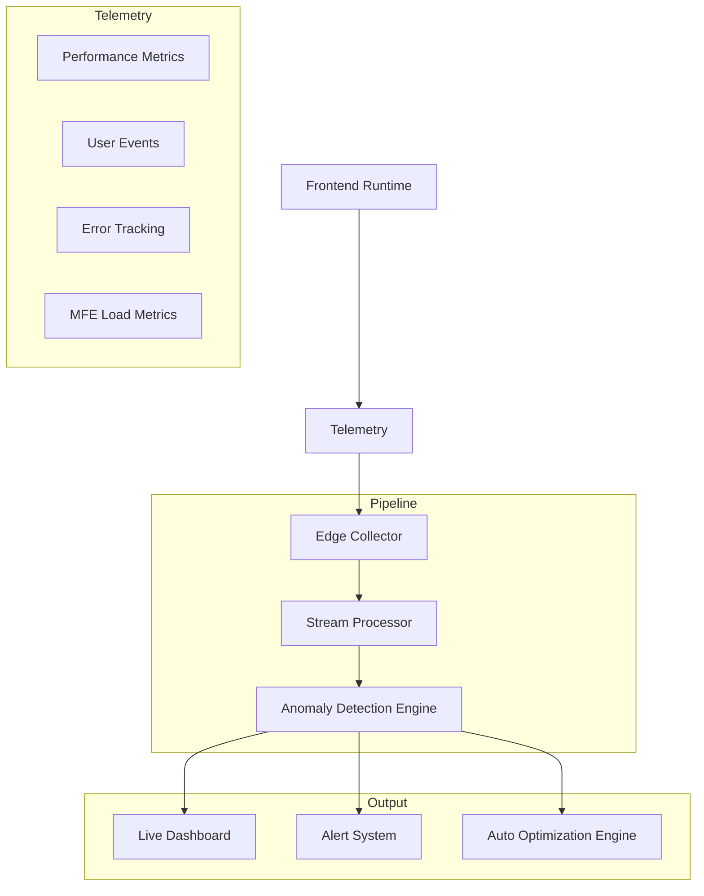

# 🚀 PLANETARY UI PLATFORM — ADVANCED ARCHITECTURE SPECIFICATION (v2.0)  
  
---  
  
# 1. CORE SYSTEM OVERVIEW  
  
This system defines a **planetary-scale, edge-native, AI-augmented frontend platform** built on:  
  
- Micro-frontend architecture  
- Edge-first deployment  
- Streaming SSR  
- AI-driven routing  
- Self-optimizing observability layer  
  
---  
  
# 2. SYSTEM ARCHITECTURE (MERMAID — BASE MODEL)  
  
```mermaid  
flowchart TB  
  
  user[User Browser]  
  
  subgraph Edge[Edge Intelligence Layer]  
    geo[Geo Router]  
    device[Device Classifier]  
    net[Network Profiler]  
    decision[Route Decision Engine]  
  end  
  
  subgraph Runtime[Frontend Runtime]  
    ssr[Streaming SSR Engine]  
    mfe[MFE Orchestrator]  
    ai[AI Prediction Engine]  
    cache[Multi-Layer Cache]  
  end  
  
  subgraph Origin[Origin Systems]  
    api[API Gateway]  
    graph[GraphQL/BFF Layer]  
    db[(Distributed Database)]  
  end  
  
  user --> Edge  
  Edge --> Runtime  
  Runtime --> Origin  
```  
  
---  
  
# 3. ✅ UPGRADE 1 — STRUCTURIZR DSL (ENTERPRISE C4 MODEL)  
  
```dsl  
workspace "Planetary UI Platform" {  
  
  model {  
    user = person "End User"  
  
    system = softwareSystem "Planetary-Scale UI Platform" {  
  
      edge = container "Edge Intelligence Layer" {  
        geo = component "Geo Router"  
        device = component "Device Classifier"  
        net = component "Network Profiler"  
        decision = component "Route Decision Engine"  
      }  
  
      ssr = container "Streaming SSR Engine"  
      mfe = container "Micro-Frontend Runtime"  
      ai = container "AI Prediction Engine"  
      cache = container "Multi-Layer Cache"  
  
      user -> system "Uses"  
      system -> edge "Routes through"  
      system -> ssr "Streams UI via"  
      system -> mfe "Loads UI modules via"  
      system -> ai "Requests predictions from"  
      system -> cache "Reads/writes cache"  
    }  
  }  
  
  views {  
    systemContext system {  
      include *  
      autolayout lr  
    }  
  
    container system {  
      include *  
      autolayout lr  
    }  
  }  
}  
```  
  
---  
  
# 4. ⚙️ UPGRADE 2 — EDGE DEPLOYMENT ARCHITECTURE  
  
```mermaid  
flowchart TB  
  
  user[User Browser]  
  
  subgraph EdgeNetwork[Global Edge Network]  
    router[Edge Router Worker]  
    aiEdge[AI Inference Edge Cache]  
    ssrEdge[Streaming SSR Edge Function]  
    mfeEdge[MFE Manifest Resolver]  
  end  
  
  subgraph Origin[Origin Layer]  
    api[API Gateway]  
    graph[GraphQL / BFF Layer]  
    db[(Distributed DB)]  
  end  
  
  user --> router  
  
  router --> aiEdge  
  router --> ssrEdge  
  router --> mfeEdge  
  
  ssrEdge --> api  
  mfeEdge --> api  
  aiEdge --> graph  
  
  api --> db  
```  
  
### Key Capabilities  
  
- SSR executed at edge  
- AI inference cached globally  
- MFE resolution without origin latency  
- Origin handles only stateful operations  
  
---  
  
# 5. 🧪 UPGRADE 3 — FULL REPOSITORY SCAFFOLD  
  
```text  
/  
**├──** apps/  
│   **├──** shell/  
│   **├──** web-home/  
│   **├──** web-ai/  
│   **├──** web-launchpad/  
│   **├──** web-cart/  
│   **└──** web-account/  
│  
**├──** edge/  
│   **├──** ai-router-worker/  
│   **├──** ssr-worker/  
│   **├──** mfe-manifest-worker/  
│   **└──** geo-router-worker/  
│  
**├──** packages/  
│   **├──** ui/  
│   **├──** design-system/  
│   **├──** runtime/  
│   **├──** mfe-orchestrator/  
│   **├──** ai-client/  
│   **├──** event-bus/  
│   **├──** contracts/  
│   **└──** cache-layer/  
│  
**├──** infra/  
│   **├──** cloudflare/  
│   **├──** vercel/  
│   **├──** kubernetes/  
│   **└──** terraform/  
│  
**├──** observability/  
│   **├──** logs/  
│   **├──** metrics/  
│   **├──** tracing/  
│   **└──** dashboards/  
│  
**├──** docs/  
│   **├──** architecture/  
│   **├──** c4/  
│   **├──** sequence/  
│   **└──** decisions/  
```  
  
---  
  
# 6. 🧠 UPGRADE 4 — AI ROUTING MODEL  
  

  
### Capabilities  
  
- Predicts next route  
- Preloads required MFEs  
- Optimizes hydration order  
- Reduces perceived latency to near-zero  
  
---  
  
# 7. 🔥 UPGRADE 5 — OBSERVABILITY + PERFORMANCE BUDGET SYSTEM  
  

  
### Capabilities  
  
- Real-time performance monitoring  
- MFE-level bottleneck detection  
- Automatic anomaly detection  
- AI-driven optimization suggestions  
- SLO enforcement for frontend runtime  
  
---  
  
# 8. SYSTEM-WIDE IMPACT OF ALL 5 UPGRADES  
  
## 1. Structurizr DSL  
  
→ Enterprise architecture governance layer  
  
## 2. Edge Deployment Model  
  
→ Global ultra-low latency execution  
  
## 3. Full Repository Scaffold  
  
→ Production-ready implementation structure  
  
## 4. AI Routing Model  
  
→ Predictive UI + intelligent preloading  
  
## 5. Observability System  
  
→ Self-healing, measurable frontend OS  
  
---  
  
# 9. FINAL ARCHITECTURAL STATE  
  
The system now operates as:  
  
```text  
AI-NATIVE FRONTEND OPERATING SYSTEM  
        +  
EDGE DISTRIBUTED EXECUTION LAYER  
        +  
MICRO-FRONTEND APPLICATION FABRIC  
        +  
REAL-TIME OBSERVABILITY ENGINE  
```  
  
---  
  
# 10. NEXT EVOLUTION PATHS  
  
evolve into:  
  
- Autonomous UI optimization engine  
- Self-healing frontend runtime  
- AI-generated UI composition system  
- Fully predictive navigation OS  
- Zero-request navigation architecture  
  
---  
---  
⚡ Module Federation v2 runtime implementation\  
⚡ Cloudflare Workers edge deployment code\  
⚡ AI routing model training pipeline\  
⚡ Full Kubernetes + Terraform production setup\  
⚡ Self-healing frontend recovery system  

---

# 11. 🎨 PLANETARY UI CSS FOUNDATION ARCHITECTURE (v2.1 — PHASE 2 IMPLEMENTED)

## Token Hierarchy & Cascade Layers

```text
@layer reset, tokens, base, components, utilities, overrides;

DESIGN TOKENS (@holokai/design-tokens)
      ↓
CSS CUSTOM PROPERTIES (--pui-* primitives, --color-* semantic)
      ↓
TAILWIND PRESET (packages/design-tokens/tailwind.preset.ts)
      ↓
DESIGN PRIMITIVES (@holokai/ui)
      ↓
APPLICATION SURFACES (apps/shell, apps/web-oracle, apps/web-archive)
```

### Core Specifications Implemented

1. **Cascade Layer Orchestration**: Master entry point [packages/design-tokens/src/index.css](file:///c:/Users/ENGR BILLI/HoloKai-Systems-Labs/packages/design-tokens/src/index.css) enforcing cascade precedence.
2. **Two-Level Color System**: Raw `--pui-*` primitives mapped to contextual `--color-*` semantic tokens with dark theme (`[data-theme="dark"]`), light theme (`:root`), and white-label brand overrides (`[data-brand="planetary"]`, `[data-brand="enterprise"]`).
3. **Token Scales**: 13-step typography scale (`--text-xs` to `--text-9xl`), 4px grid spacing (`--space-0` to `--space-48`), 8-step border radius (`--radius-xs` to `--radius-full`), shadow depth scale (`--shadow-sm` to `--shadow-xl`), 6 motion durations (`--duration-instant` to `--duration-cinematic`), and 4 easings (`--ease-planetary`).
4. **Motion & Stagger**: Entrance keyframes (`pui-fade-in`, `pui-rise`, `pui-scale-reveal`) and CSS stagger system (`[data-motion-item]` consuming `--motion-index`).
5. **Accessibility**: Global `prefers-reduced-motion` reduction rules and `.sr-only` class in [accessibility.css](file:///c:/Users/ENGR BILLI/HoloKai-Systems-Labs/packages/design-tokens/src/foundation/accessibility.css).
6. **Shared Tailwind Preset**: [packages/design-tokens/tailwind.preset.ts](file:///c:/Users/ENGR BILLI/HoloKai-Systems-Labs/packages/design-tokens/tailwind.preset.ts) wired to all monorepo applications via `@import '@holokai/design-tokens'`.

