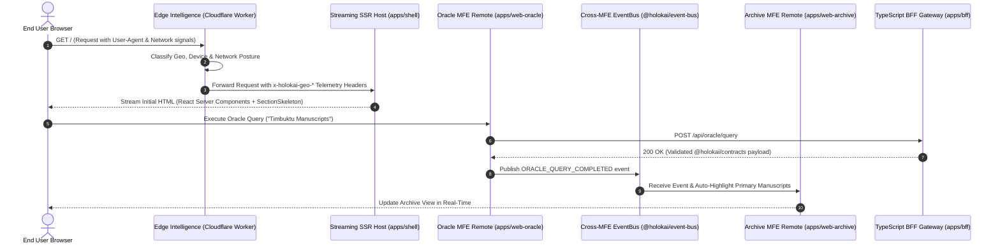

# Planetary UI Platform — End-to-End User Request Sequence Diagram

```mermaid
sequenceDiagram
    autonumber
    actor User as End User Browser
    participant Edge as Edge Intelligence (Cloudflare Worker)
    participant Shell as Streaming SSR Host (apps/shell)
    participant MFE as Oracle MFE Remote (apps/web-oracle)
    participant EventBus as Cross-MFE EventBus (@holokai/event-bus)
    participant Archive as Archive MFE Remote (apps/web-archive)
    participant BFF as TypeScript BFF Gateway (apps/bff)

    User->>Edge: GET / (Request with User-Agent & Network signals)
    Edge->>Edge: Classify Geo, Device & Network Posture
    Edge->>Shell: Forward Request with x-holokai-geo-* Telemetry Headers
    Shell-->>User: Stream Initial HTML (React Server Components + SectionSkeleton)
    
    User->>MFE: Execute Oracle Query ("Timbuktu Manuscripts")
    MFE->>BFF: POST /api/oracle/query
    BFF-->>MFE: 200 OK (Validated @holokai/contracts payload)
    MFE->>EventBus: Publish ORACLE_QUERY_COMPLETED event
    EventBus->>Archive: Receive Event & Auto-Highlight Primary Manuscripts
    Archive-->>User: Update Archive View in Real-Time
```
